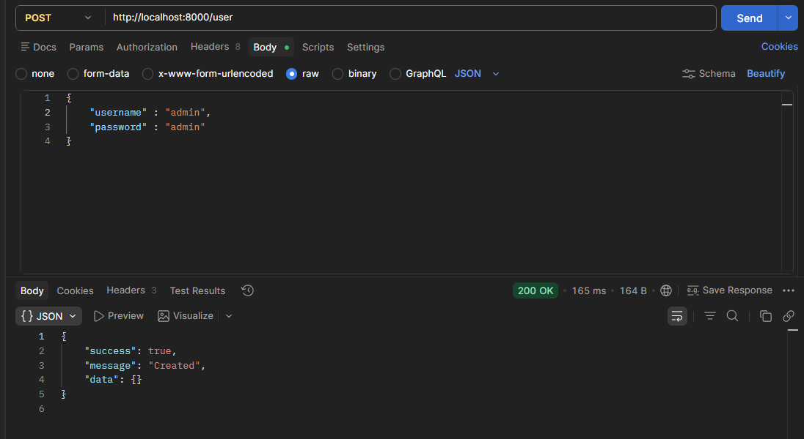
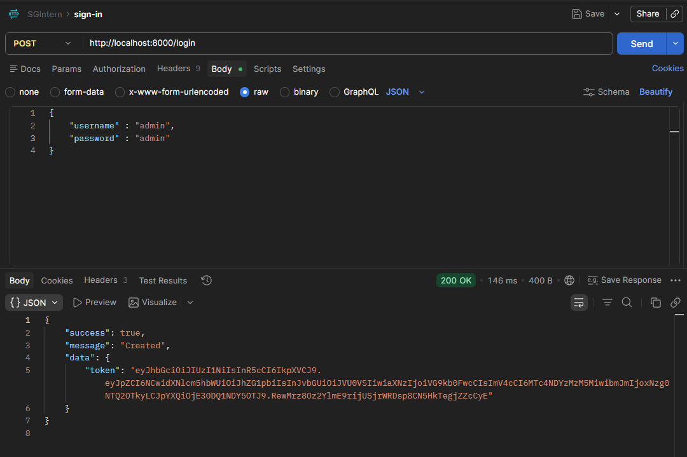
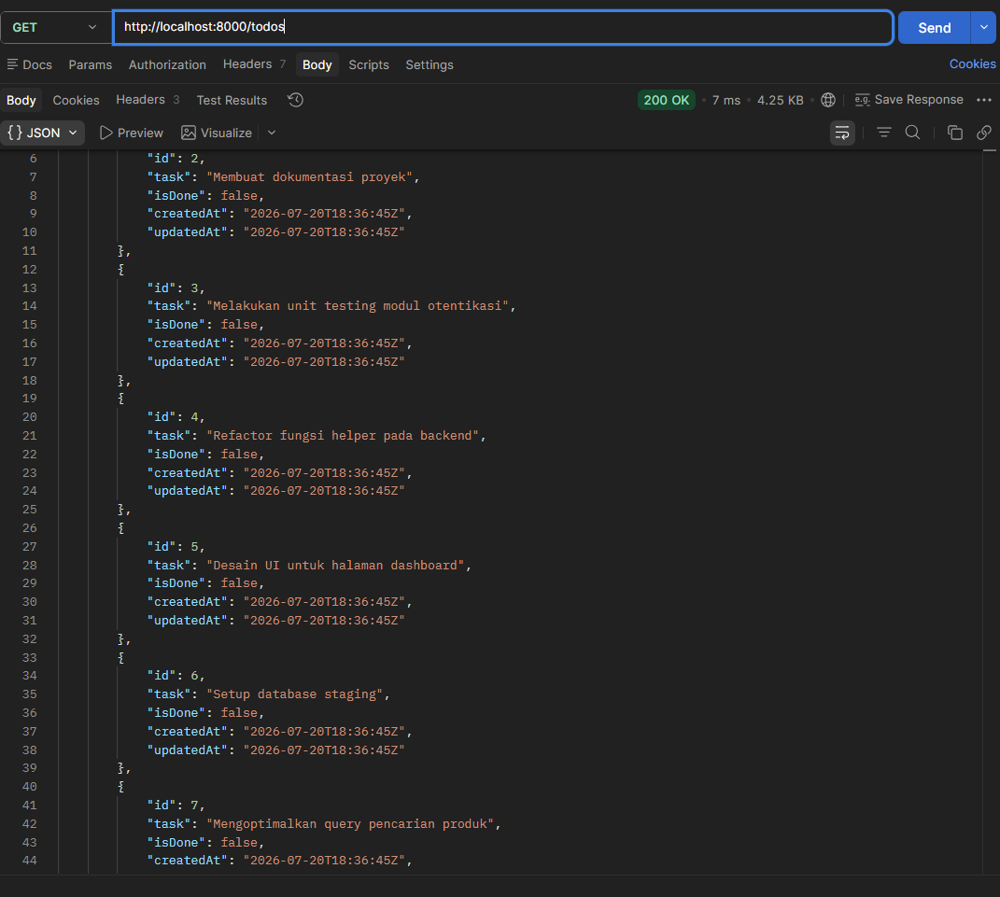
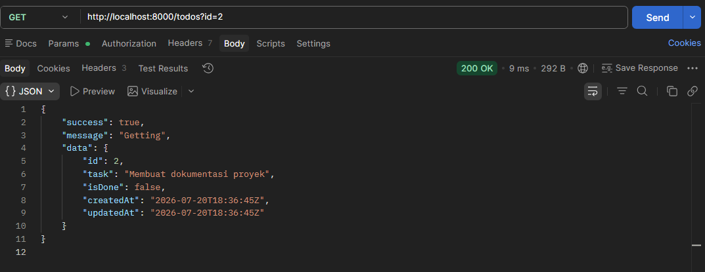
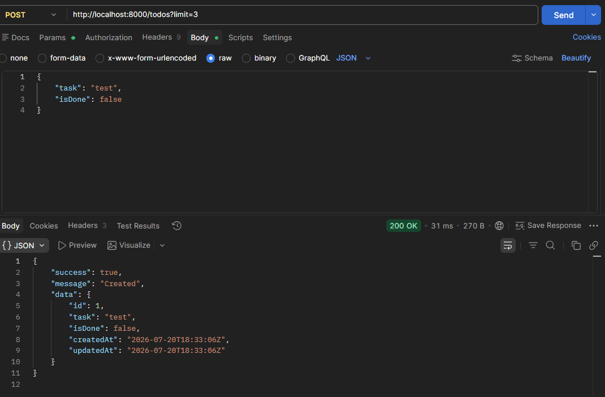
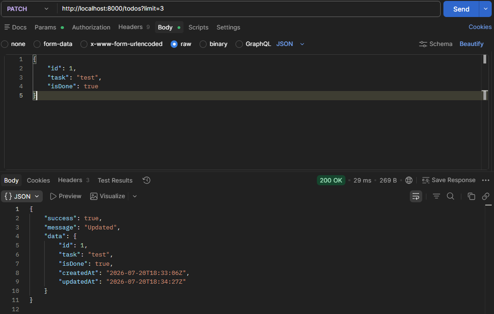
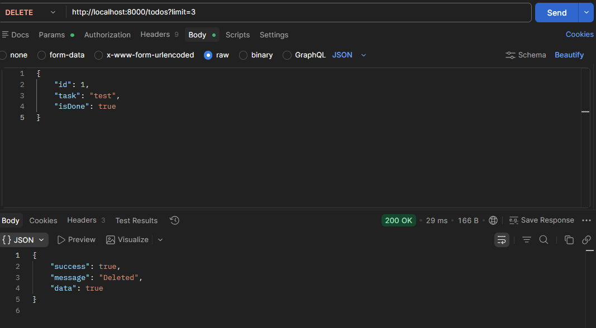
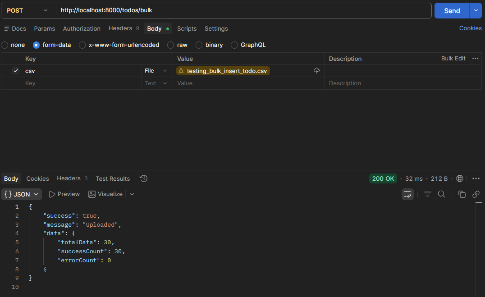
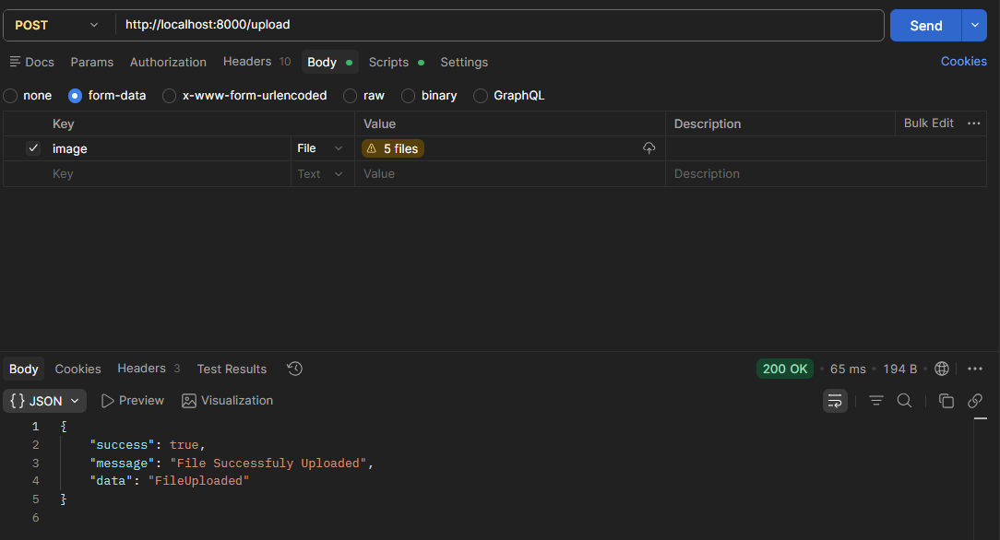
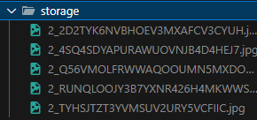

# Go REST API

REST API written in Go that demonstrates Clean Architecture, dependency injection, streaming file processing, worker pools, and pipeline concurrency for efficient bulk data processing.

## Features

- JWT Authentication
- CRUD Todo
- Image Upload
- CSV Bulk Import
- Validation
- Transaction
- Logging Middleware
- Worker Pool
- Pipeline Streaming

## Flows
```bash 
Client
   │
HTTP Handler
   │
Mapper
   │
Service
   │
Repository
   │
MySQL/Postgre/etc
```


## Configuration

The application is configured using environment variables. You can find the required variables in the `.env.example` file.

Create a `.env` file in the root directory:
```env
DB_HOST=localhost
DB_PORT=5432
DB_USER=root
DB_PASSWORD=secret
DB_NAME=rest_api
SECRET_AUTH=your_secret_key
```

## Database Setup

Before running the application, make sure you import the initial database schema to your MySQL database. You can find the schema file in the `migrate/mysql/` directory.

To import it, run the following command in your terminal (make sure to replace the username, password, and database name with your own):
```bash
mysql -u root -p rest_api < migrate/mysql/000_initial.sql
```

## Running the Application

Ensure you have your `.env` configured properly. The server runs on port `8000` by default.

```bash
go run cmd/api/main.go
```

## Internal Package Mapper

The `internal` directory contains the core application logic, categorized by domain and technical concerns. Here is the mapping of each package and its corresponding environment variable dependencies:

| Package | Description | Environment Variable (`.env`) |
| :--- | :--- | :--- |
| `application` | Core application setup, wiring, and interfaces. | - |
| `auth` | Authentication logic, including JWT generation and validation. | `SECRET_AUTH` |
| `csv` | Utilities for processing and parsing CSV files. | - |
| `database` | Database connection setup and transaction management. | `DB_HOST`, `DB_PORT`, `DB_USER`, `DB_PASSWORD`, `DB_NAME` |
| `http` | HTTP server configuration, middlewares, and common response handlers. | - |
| `image` | Handling image/file uploads and local storage interactions. | `LOCAL_STORAGE_PATH` |
| `logging` | Custom logging implementations and middleware. | - |
| `pipeline` | Concurrency patterns (e.g., pipeline streaming) implementations. | - |
| `query` | Database query builders or pagination helpers. | - |
| `reader` | Utilities for file or stream reading operations. | - |
| `todos` | Todo domain feature (Handlers, Services, Repositories). | - |
| `user` | User domain feature (Handlers, Services, Repositories). | - |
| `utils` | General purpose helper functions and utilities. | - |

## Bootstrap Process

The application follows a structured initialization flow in `main.go`:
1. **Environment & Configuration**: Loads `.env` file (`config.LoadEnv()`) and initializes the config object.
2. **Database Initialization**: Connects to the database and sets up a DB transaction manager.
3. **Repository Layer**: Instantiates repositories (`TodoLogRepository`, `TodoMemory`, `AuthRepository`).
4. **Service Layer**: Instantiates services with their required dependencies injected (`TodoService`, `JWTService`, `AuthService`).
5. **Handler Layer**: Instantiates HTTP handlers (`TodoHandler`, `AuthHandler`, `ImageHandler`).
6. **Router & Endpoints**: Creates an `http.ServeMux` and registers all routes.
7. **Middlewares**: Chains global middlewares (e.g., Logging and Authentication) wrapping the multiplexer.
8. **Server Start**: Configures the HTTP server (e.g., timeouts, port `:8000`) and starts listening for requests (`server.ListenAndServe()`).

## Endpoints

Based on the available handlers, the API provides the following services and their functionalities:

### Auth Service
- **Login** (`POST /login`): Authenticates a user and returns a JWT token. (Requires JSON payload with credentials)
Example: 
```json
{
    "username": "admin",
    "password": "password"
}
```


- **Register** (`POST /register`): Registers a new user. (Requires JSON payload with credentials)
Example: 
```json
{
    "username": "admin",
    "password": "password"
}
```


### Todos Service
- **GetAll** (`GET /todos`): Retrieves all todos. Can be filtered by `id` query parameter.


- **GetById** (`GET /todos?id={id}`): Retrieves a specific todo by `id` query parameter.


- **Create** (`POST /todos`): Creates a new todo. (Requires Auth & JSON payload)
Example: 
```json
{
   "task" : "task Title"
}
```


- **Update** (`PATCH /todos`): Updates an existing todo. (Requires Auth & JSON payload)
Example: 
```json
{
   "id": 1,
   "task" : "task Title",
   "isDone": false
}
```


- **Delete** (`DELETE /todos`): Deletes a todo. (Requires Auth & JSON payload)


- **Upload CSV** (`POST /todos/bulk`): Bulk creates todos from an uploaded CSV file. (Requires Auth & Multipart form data)


### Image Service
- **Upload** (`POST /upload`): Uploads an image file (Multipart form data). Requires Auth.




## Design Decisions

1. **Dependency Injection**: All dependencies are injected into their respective layers.
2. **Clean Architecture**: Separated layers (Handler, Service, Repository, Config) for better maintainability.
3. **Streaming**: Uses streaming to process large files efficiently.
4. **Worker Pool**: Uses a worker pool to process tasks in parallel.
5. **Pipeline**: Uses a pipeline to process data in parallel.

Why add a mapper layer? The handler layer must not interact directly with the service layer, as the service layer is responsible solely for application logic; the mapper layer therefore handles translating requests from the handler to the service.

Why use stream jobs? HTTP requests can be time-consuming, to avoid timeouts, the application processes data immediately without waiting for the request to complete. Goroutines are used to handle this asynchronous processing.

Why not use a standard layered architecture? While layered architecture is suitable for simple applications, organizing code by layer, it becomes difficult to manage as a project grows and its domain complexity increases.

Why does the repository return an interface? Returning an interface facilitates mocking during testing and minimizes code changes when switching databases, furthermore, the service layer remains decoupled from the repository's internal implementation.

Why define DTO contracts within the handler and service layers? Defining DTO contracts simplifies incoming data validation and modification, and makes it easier to update service contracts.

How are requests tracked? Before reaching the handler, requests pass through middleware that generates a unique request ID, this ID is logged to facilitate analysis should issues arise.

Why create a simple worker abstraction for stream jobs? The project involves numerous stream processes, handling channels, cancellation, and reporting directly within the main logic would clutter the codebase. A simple worker abstraction encapsulates these concerns, keeping the code clean and readable.